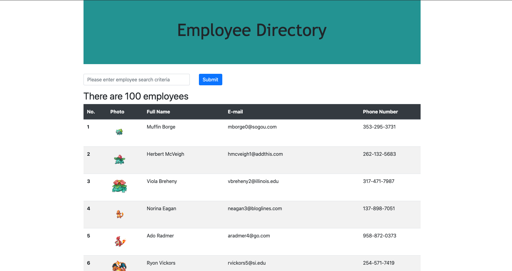

# React Employee Directory

https://radiant-island-45826.herokuapp.com/

## Description

Businesses depend on structured systems to organize their employee database. This project recreates such a database through the use of React. Users can search through employees by using any relevant parameters such as name, email, or phone number. The technologies used include Node, React, Regex, and Mockaroo.com for api calls.

## User Story

AS A user, I want to search the employee directory\
I WANT to enter an employees's information\
SO THAT I can find an employee

## License

Distributed under the MIT license.